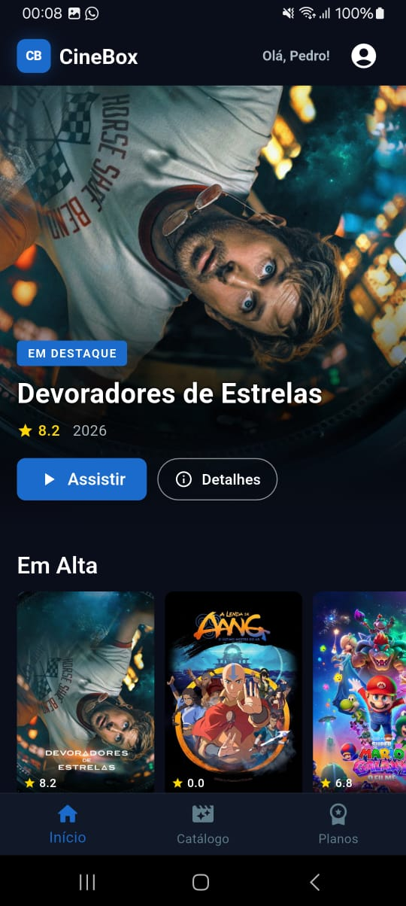
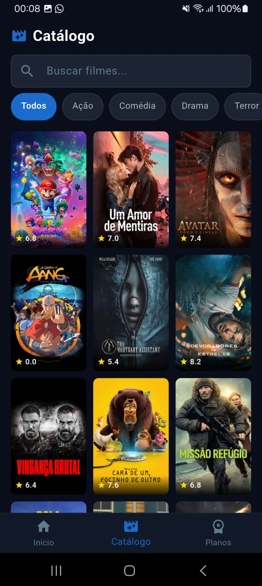
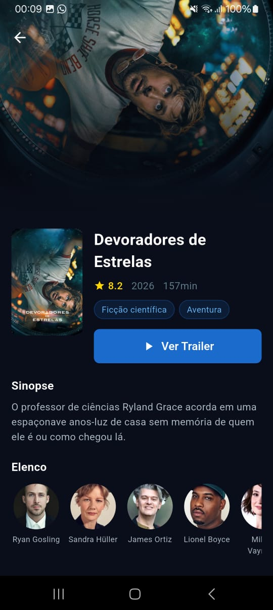
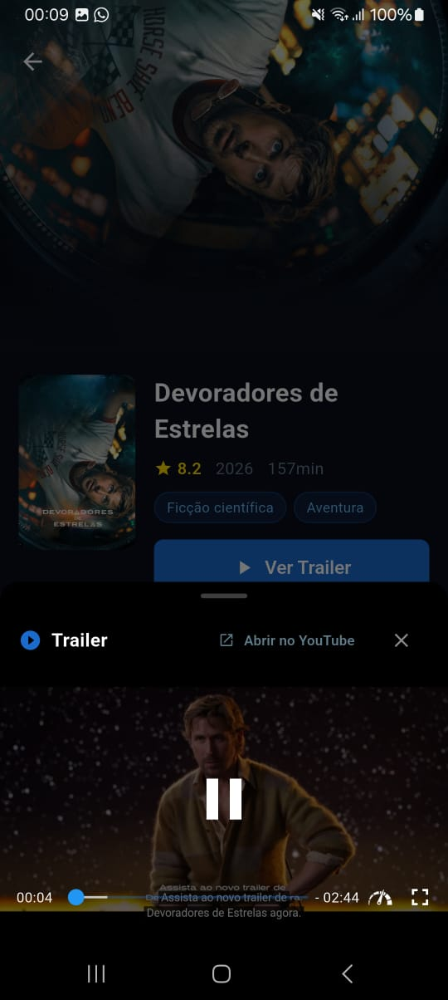
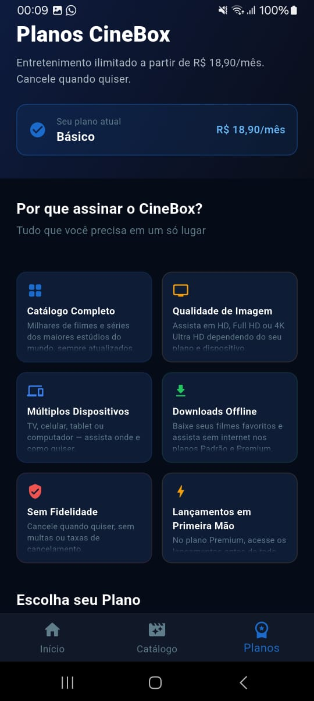
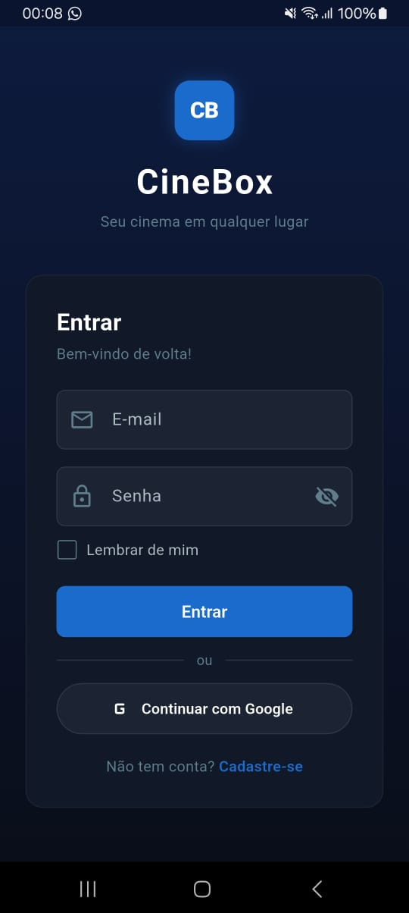
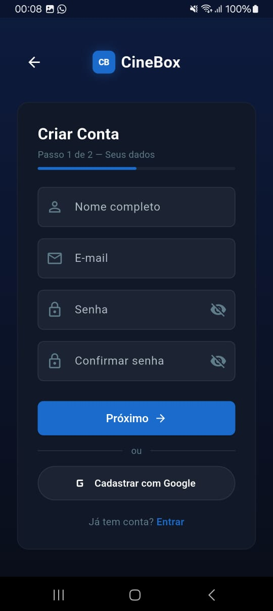
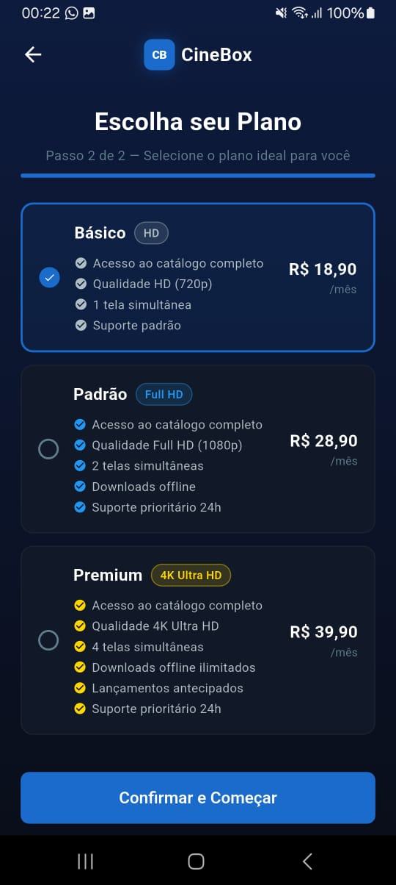

# 📱 CineBox Mobile

> Trabalho acadêmico desenvolvido para a disciplina de **Desenvolvimento Mobile** do curso de **Análise e Desenvolvimento de Sistemas** da **Uni-FACEF — Centro Universitário Municipal de Franca**.

---

## 📋 Sobre o Projeto

O **CineBox Mobile** é um aplicativo de streaming de filmes desenvolvido em **Flutter**, inspirado em serviços como Netflix. O app simula uma experiência completa de plataforma de entretenimento, com catálogo de filmes em tempo real, sistema de busca, filtros por gênero, detalhes de filmes com elenco e trailer reproduzido dentro do próprio app, planos de assinatura e autenticação real via Firebase — tudo sem back-end próprio.

O projeto faz parte de um ecossistema multiplataforma: existe também uma **aplicação web CineBox** desenvolvida em React, que compartilha a mesma base de dados do Firebase e consome as mesmas APIs externas (TMDB), garantindo uma experiência consistente entre web e mobile. Um usuário cadastrado no app mobile pode fazer login na versão web com as mesmas credenciais, e vice-versa.

O objetivo acadêmico foi aplicar na prática os conceitos de desenvolvimento mobile moderno, incluindo arquitetura de features, consumo de APIs REST, navegação com roteamento declarativo, autenticação real com Firebase Auth, persistência com Firestore e construção de interfaces responsivas com Flutter.

---

## ✨ Funcionalidades

### 🏠 Tela Inicial (Home)
- Banner hero com o filme em destaque da semana, com backdrop em tela cheia, gradiente e botões de ação
- Múltiplas seções de filmes organizadas por categoria: **Em Alta, Mais Populares, Mais Bem Avaliados, Em Cartaz e Em Breve**
- Carrosséis horizontais com scroll suave por seção
- Pull-to-refresh para atualizar todos os dados
- Saudação personalizada com o nome do usuário logado
- Menu de perfil com acesso a **Meu Plano** e **Sair**

### 🎬 Catálogo
- Exibição de filmes populares como padrão ao entrar na tela
- **Filtros por gênero** em formato de chips horizontais: Todos, Ação, Comédia, Drama, Terror, Ficção Científica, Romance, Animação, Crime, Thriller, Aventura e Documentário
- **Busca em tempo real** por título de filme
- **Paginação infinita** com carregamento automático ao chegar no fim da lista
- Grid de 3 colunas com poster, nota e título de cada filme

### 🎞️ Detalhes do Filme
- Backdrop em tela cheia com gradiente suave
- Poster, título, nota (⭐), ano de lançamento e duração
- Pills de gênero com estilo consistente
- **Botão "Ver Trailer"** que abre o trailer oficial do YouTube **dentro do próprio app** com player embutido, controles de reprodução e barra de progresso
- Botão de fallback **"Abrir no YouTube"** para assistir no app do YouTube
- Sinopse completa em português (pt-BR)
- Carrossel de elenco com foto circular, nome dos 10 primeiros atores

### 💳 Planos de Assinatura
- Três planos: **Básico (R$ 18,90)**, **Padrão (R$ 28,90)** e **Premium (R$ 39,90)**
- Seção **"Por que assinar o CineBox?"** com 6 cards: Catálogo Completo, Qualidade de Imagem, Múltiplos Dispositivos, Downloads Offline, Sem Fidelidade e Lançamentos em Primeira Mão
- Cards de plano com badge de destaque, chips de destaques rápidos e lista de features com check ✓ e cross ✗ (itens indisponíveis aparecem riscados)
- Indicação visual do plano atual do usuário
- Botões de **Upgrade** e **Downgrade** com dialog de confirmação
- Toast de sucesso/erro após alteração de plano
- Tabela comparativa entre os três planos com ícones visuais

### 🔐 Autenticação com Firebase
- **Cadastro em 2 passos**: dados pessoais (nome, e-mail, senha) → seleção de plano
- **Login com e-mail e senha** com validação real contra o Firebase Authentication
- **Login e cadastro com Google** (OAuth 2.0)
- Opção **"Lembrar de mim"**: ao desmarcar, o usuário é deslogado automaticamente ao fechar o app
- Dados do usuário (nome, e-mail, plano, data de cadastro) persistidos no **Firestore**
- Redirecionamento automático baseado no estado de autenticação via `authStateChanges`
- Mensagens de erro traduzidas para português (e-mail já cadastrado, senha incorreta, usuário não encontrado, etc.)

---

## 📱 Instalação do App

### Pré-requisitos
- Dispositivo Android com versão **5.0 (Lollipop) ou superior**
- Permissão para instalar apps de fontes desconhecidas habilitada

### Como instalar

1. Acesse as [**Releases**](../../releases) do repositório
2. Baixe o arquivo `cinebox.apk` da versão mais recente
3. Abra o arquivo no seu dispositivo Android
4. Toque em **Instalar** e aguarde a conclusão
5. Abra o **CineBox** na sua tela inicial

> **Nota:** Caso apareça o aviso "Instalar apps desconhecidos", vá em **Configurações → Segurança → Fontes desconhecidas** e habilite para o seu navegador ou gerenciador de arquivos.

---

## 🌐 Integração com a Versão Web

O CineBox Mobile faz parte de um ecossistema multiplataforma junto ao **CineBox Web**, desenvolvido em React.

| Aspecto | Web (React) | Mobile (Flutter) |
|---|---|---|
| Autenticação | Firebase Auth | Firebase Auth |
| Banco de dados | Firestore | Firestore |
| Dados de filmes | TMDB API v3 | TMDB API v3 |
| Persistência de sessão | Firebase Auth SDK | SharedPreferences + Firebase Auth |
| Plataforma | Vercel | Android / iOS |

- Um usuário cadastrado no app mobile pode fazer login na versão web com as mesmas credenciais, e vice-versa
- O plano de assinatura escolhido é salvo no Firestore e acessível em ambas as plataformas
- Ambas as plataformas consomem os mesmos endpoints da TMDB com os mesmos parâmetros (`language=pt-BR`)
- A estrutura de dados no Firestore é compartilhada: `users/{uid}` com campos `name`, `email`, `plan` e `createdAt`

---

## 🛠️ Tecnologias Utilizadas

| Tecnologia | Versão | Finalidade |
|---|---|---|
| [Flutter](https://flutter.dev/) | 3.38.9 | Framework principal de UI multiplataforma |
| [Dart](https://dart.dev/) | 3.10.8 | Linguagem de programação |
| [Firebase Auth](https://firebase.google.com/products/auth) | ^5.3.1 | Autenticação de usuários |
| [Cloud Firestore](https://firebase.google.com/products/firestore) | ^5.4.4 | Banco de dados em tempo real |
| [Firebase Core](https://firebase.google.com/products/core) | ^3.6.0 | Inicialização do Firebase |
| [Google Sign In](https://pub.dev/packages/google_sign_in) | ^6.2.1 | Autenticação OAuth com Google |
| [GoRouter](https://pub.dev/packages/go_router) | ^14.3.0 | Roteamento declarativo |
| [Cached Network Image](https://pub.dev/packages/cached_network_image) | ^3.4.1 | Cache de imagens da rede |
| [YouTube Player Flutter](https://pub.dev/packages/youtube_player_flutter) | ^9.1.1 | Player de vídeo do YouTube embutido |
| [URL Launcher](https://pub.dev/packages/url_launcher) | ^6.3.0 | Abertura de links externos |
| [Shared Preferences](https://pub.dev/packages/shared_preferences) | ^2.3.2 | Persistência local de preferências |
| [HTTP](https://pub.dev/packages/http) | ^1.2.2 | Requisições HTTP para a TMDB API |
| [TMDB API](https://www.themoviedb.org/documentation/api) | v3 | Fonte de dados de filmes em tempo real |

---

## 🌐 API Externa

### TMDB — The Movie Database

Principal e única fonte de dados do projeto. API pública com um dos maiores bancos de dados de filmes do mundo.

| Endpoint | Descrição |
|---|---|
| `GET /trending/movie/week` | Filmes em alta na semana (destaque da Home) |
| `GET /movie/popular` | Filmes populares (seção Home e padrão do Catálogo) |
| `GET /movie/top_rated` | Filmes mais bem avaliados |
| `GET /movie/now_playing` | Filmes em cartaz |
| `GET /movie/upcoming` | Filmes em breve |
| `GET /discover/movie` | Filmes filtrados por gênero |
| `GET /search/movie` | Busca de filmes por título |
| `GET /movie/{id}?append_to_response=credits,videos` | Detalhes completos, elenco e trailers |

**Parâmetros aplicados em todas as requisições:**
- `language=pt-BR` — títulos e sinopses em português brasileiro

---

## 🔥 Firebase

O projeto utiliza dois serviços do Firebase:

### Firebase Authentication
- Cadastro e login com **e-mail e senha**
- Login com **Google** (OAuth 2.0)
- Persistência de sessão controlada via `SharedPreferences` + `signOut` no `main()`
- Redirecionamento automático via `authStateChanges` com `refreshListenable` no GoRouter

### Cloud Firestore
- Coleção `users` com documentos indexados pelo `uid` do Firebase Auth
- Campos armazenados: `name`, `email`, `plan`, `createdAt`
- Operações com `SetOptions(merge: true)` para criação e atualização sem sobrescrever dados
- Atualização de plano via `update({'plan': planId})` no documento existente

### Estrutura de dados

```
users/{uid}
├── name: String        — nome completo do usuário
├── email: String       — e-mail do usuário
├── plan: String        — "basic" | "standard" | "premium"
└── createdAt: Timestamp — data de criação da conta
```

### Regras de segurança do Firestore

```
rules_version = '2';
service cloud.firestore {
  match /databases/{database}/documents {
    match /users/{userId} {
      allow read, write: if request.auth != null && request.auth.uid == userId;
    }
  }
}
```

---

## 🗂️ Estrutura do Projeto

```
cinebox/
├── android/                          # Configurações Android
│   └── app/
│       ├── google-services.json      # Configuração do Firebase (não versionado)
│       └── src/main/
│           └── AndroidManifest.xml   # Manifest com nome do app e permissões
├── assets/
│   └── images/
│       └── icon.jpeg                 # Ícone do app
├── lib/
│   ├── core/
│   │   ├── models/
│   │   │   ├── movie_model.dart      # Modelo de filme com URLs de imagem
│   │   │   ├── plan_model.dart       # Modelo de plano com dados estáticos
│   │   │   └── user_model.dart       # Modelo de usuário do Firestore
│   │   ├── router/
│   │   │   └── app_router.dart       # Roteamento com GoRouter e authStateChanges
│   │   ├── services/
│   │   │   ├── auth_service.dart     # Firebase Auth + Firestore (login, cadastro, Google)
│   │   │   ├── firestore_service.dart # Operações no Firestore
│   │   │   └── tmdb_service.dart     # Integração com a TMDB API
│   │   └── theme/
│   │       └── app_theme.dart        # Paleta de cores e tema global
│   ├── features/
│   │   ├── auth/
│   │   │   ├── login_screen.dart     # Tela de login (e-mail/senha e Google)
│   │   │   ├── register_screen.dart  # Tela de cadastro — passo 1 (dados)
│   │   │   └── select_plan_screen.dart # Tela de cadastro — passo 2 (plano)
│   │   ├── catalog/
│   │   │   └── catalog_screen.dart   # Catálogo com busca, filtros e paginação infinita
│   │   ├── home/
│   │   │   └── home_screen.dart      # Home com banner destaque e seções de filmes
│   │   ├── movie_detail/
│   │   │   └── movie_detail_screen.dart # Detalhes do filme com player de trailer
│   │   └── plans/
│   │       └── plans_screen.dart     # Planos de assinatura com upgrade/downgrade
│   ├── shared/
│   │   └── widgets/
│   │       ├── cinebox_logo.dart     # Widget do logo CB reutilizável
│   │       ├── main_scaffold.dart    # Scaffold com bottom navigation bar
│   │       ├── movie_card.dart       # Card de filme com poster e nota
│   │       └── movie_section.dart    # Seção horizontal de filmes com título
│   ├── firebase_options.dart         # Configurações geradas pelo FlutterFire CLI
│   └── main.dart                     # Ponto de entrada com inicialização do Firebase
├── pubspec.yaml                      # Dependências e configurações do projeto
└── README.md
```

---

## 📸 Screenshots

### 🏠 Tela Inicial


### 🎬 Catálogo


### 🎞️ Detalhes do Filme


### ▶️ Trailer


### 💳 Planos de Assinatura


### 🔐 Login


### 📝 Cadastro — Passo 1


### 📝 Cadastro — Passo 2


---

## 🎨 Design System

### Paleta de Cores

| Papel | Cor | Hex |
|---|---|---|
| Primária | Azul principal | `#1A6BCC` |
| Primária escura | Azul escuro | `#0D47A1` |
| Primária clara | Azul claro | `#2196F3` |
| Destaque | Azul suave | `#64B5F6` |
| Fundo principal | Azul quase preto | `#0A0E1A` |
| Superfície | Azul escuro | `#111827` |
| Superfície variante | Cinza azulado | `#1C2333` |
| Card | Azul médio escuro | `#161D2F` |
| Ouro / Premium | Amarelo âmbar | `#FFD700` |
| Erro | Vermelho | `#EF5350` |
| Texto principal | Branco | `#FFFFFF` |
| Texto secundário | Cinza claro | `#B0BEC5` |
| Texto mudo | Cinza azulado | `#607D8B` |

### Componentes Visuais
- **Gradientes** — fundos com `LinearGradient` do azul escuro para o preto em todas as telas de auth
- **Cards com borda** — superfícies com `Border.all` em tons de azul escuro
- **Chips de destaque** — containers pequenos com cor do plano e opacidade reduzida
- **Bottom Sheet** — player de trailer em sheet deslizante com handle visual
- **Toast animado** — notificações de sucesso/erro posicionadas no topo via `Stack` + `Positioned`
- **Adaptive Icons** — ícone do app com fundo azul `#1A6BCC` e foreground com o logo CB

---

## 🚀 Como Executar Localmente

### Pré-requisitos
- [Flutter SDK](https://flutter.dev/docs/get-started/install) versão **3.0.0 ou superior**
- [Android Studio](https://developer.android.com/studio) ou [VS Code](https://code.visualstudio.com/) com extensão Flutter
- Dispositivo físico Android ou emulador configurado
- Projeto configurado no [Firebase Console](https://console.firebase.google.com/) com Authentication e Firestore habilitados
- Conta na [TMDB](https://www.themoviedb.org/) para obter a API Key

### Instalação e execução

```bash
# Clone o repositório
git clone https://github.com/seu-usuario/cinebox.git

# Acesse a pasta do projeto
cd cinebox

# Instale as dependências
flutter pub get

# Configure a API Key da TMDB
# Abra lib/core/services/tmdb_service.dart e substitua:
# static const _apiKey = 'SUA_TMDB_API_KEY';
# pela sua chave real obtida em https://www.themoviedb.org/settings/api

# Configure o Firebase
# Adicione o arquivo google-services.json em android/app/
# (obtido no Firebase Console → Configurações do projeto → Android)

# Execute o app
flutter run
```

### Configuração do Google Sign In (opcional)

Para habilitar o login com Google, adicione o SHA-1 do seu keystore no Firebase Console:

```bash
# Obtenha o SHA-1 do keystore de debug
cd android && gradlew signingReport
```

Copie o valor `SHA1` e adicione em:
**Firebase Console → Configurações do projeto → Seu app Android → Adicionar impressão digital**

Depois baixe o novo `google-services.json` e substitua em `android/app/`.

### Gerar o APK

```bash
# Build de debug
flutter build apk --debug

# Build de release
flutter build apk --release

# O APK gerado estará em:
# build/app/outputs/flutter-apk/app-release.apk
```

### Gerar ícones do app

```bash
dart run flutter_launcher_icons
```

---

## 📄 Observações Acadêmicas

- A autenticação utiliza o **Firebase Authentication**, um serviço real de autenticação. Os dados cadastrados persistem entre sessões conforme a opção "Lembrar de mim".
- Os dados dos usuários (nome, e-mail, plano) são armazenados no **Cloud Firestore**, compartilhado com a versão web do CineBox.
- A chave de API da TMDB utilizada é de uso pessoal para fins acadêmicos e de demonstração — **não versione sua chave no repositório**.
- As credenciais do Firebase (`google-services.json`) **não são versionadas** no repositório por questões de segurança.
- O projeto é **100% client-side**, sem back-end próprio — toda a lógica de servidor é delegada ao Firebase e às APIs externas.

---

## 👨‍🎓 Informações Acadêmicas

| | |
|---|---|
| **Instituição** | Uni-FACEF — Centro Universitário Municipal de Franca |
| **Curso** | Análise e Desenvolvimento de Sistemas |
| **Disciplina** | Desenvolvimento Mobile |
| **Ano** | 2026 |

---

<p align="center">
  Desenvolvido com dedicação para a <strong>Uni-FACEF</strong> · Franca, SP
</p>
